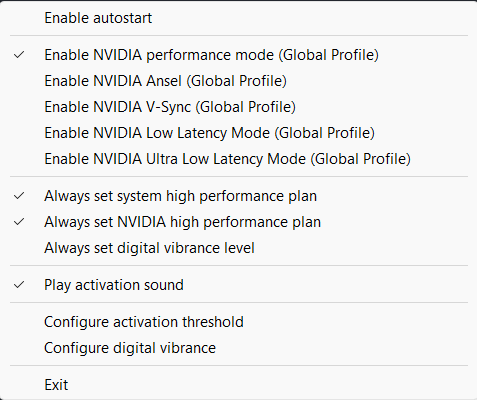

#   PowerPlanManager

The utility is designed for easy and convenient management of NVIDIA and system power settings on Windows. This tool operates entirely in tray mode. With just two clicks, you can activate the selected option, making this an ideal solution for conducting experiments and just playing. Additionally, it can help save electricity, as the power plans are dynamically changed when the tool detects that a fullscreen application is running. The utility also does not ask for administrator rights, they are only needed if you want to add it to startup. When full screen mode is detected and the utility is activated, an unobtrusive sound of a bubble bursting is emitted.

## Configuration
Configuration file is located at `%APPDATA%/PowerPlanManager/powerplanmanager.cfg`.
This project uses a configuration file with the following settings:

- **activation_threshold**: The threshold for program activation.
- **digital_vibrance**: The level of digital vibrance.
- **autostartup**: Determines whether the application starts up automatically.
- **sleep_interval_ms**: The application will pause for a certain number of milliseconds following the scan.
- **nvidia_performance_mode**: The NVIDIA performance mode setting.
- **play_activation_sound**: Determines whether to play a sound upon activation.
- **nvidia_ansel**: The NVIDIA Ansel setting.
- **nvidia_vsync**: The NVIDIA Vsync setting.
- **nvidia_low_latency_mode**: The NVIDIA Low Latency Mode setting.
- **nvidia_ultra_low_latency_mode**: The NVIDIA Ultra Low Latency Mode setting.
- **always_cpu_performance_mode**: Determines whether the CPU is always in performance mode.
- **always_nvidia_performance_mode**: Determines whether NVIDIA is always in performance mode.
- **always_vibrance_level**: The vibrance level will always be enabled.

## Building requirements
- Visual Studio 2022+
- CMake 3.16+

## Running requirements
- Microsoft Visual C++ Redistributable 2022

# Demonstration
Do not set the "always" options if you want the program to automatically return power settings to balanced (as well as nvidia vibrance settings) after quitting the game.

## Contributing

I appreciate all contributions, so if you have any ideas or suggestions, feel free to open an issue or a pull request.

## ✅Anti-cheat safety

The tool operates without injecting code into any process, making it compatible and safe to use with any game equipped with anti-cheat software.

## License

The project is licensed under the MIT License. See [LICENSE](LICENSE) for more information.

